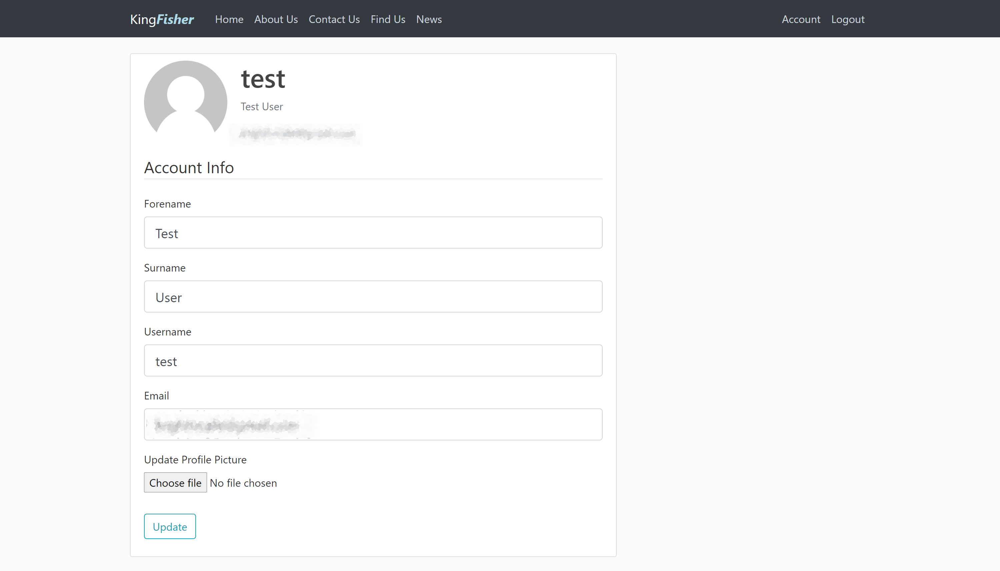
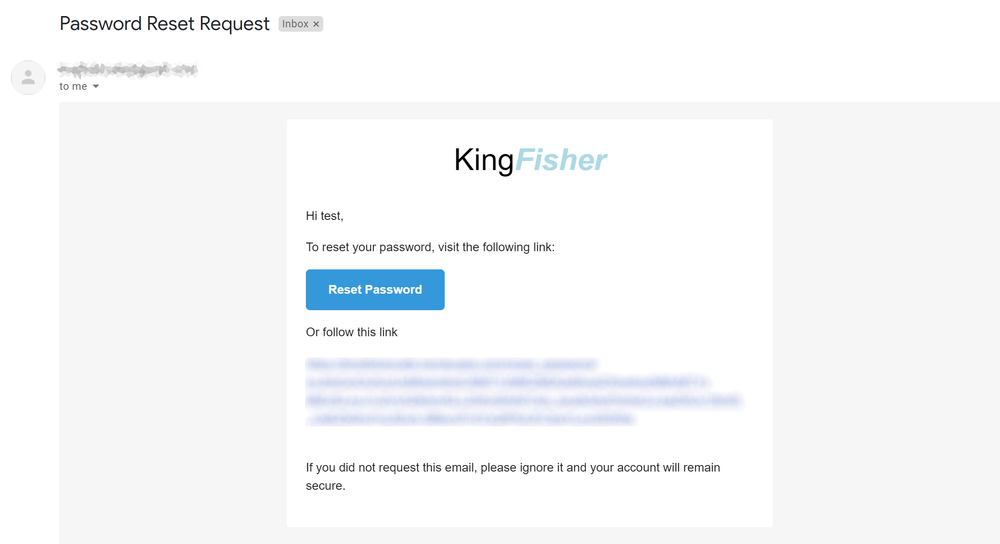

# King<em>Fisher</em>

Website developed for the Kingfisher Trust Cafe

## Setup

1. Install Python 3.8 or greater
2. Run `pip install -r requirements.txt` to install all requirements
3. Run `python initialise_db.py` to initialise the database
4. Run `python run.py` to run a _development server_
5. The website will be hosted at `localhost:5000`

## Features

Accounts can be created and edited, with user profile pictures. Implemented with a SQLAlchemy database.

Emails can be sent to the user if they forget their password, using flask_mail.

Content sections can be edited and update live with the site's in-built Content Management System (using Markdown files).

News posts can be posted, updated, and deleted by the user. Posts are saved to the database.

## License

- MIT license
- Copyright 2020 © Dominic Too.
